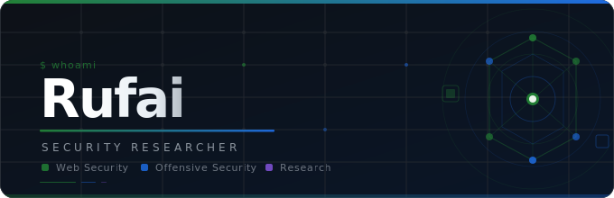

<p align="center">
  
</p>

<p align="center">
  
  
  
  
  
</p>

---

## 📝 About

The **Rufai10 Write-Ups Repository** contains carefully documented, public-safe cybersecurity write-ups.

This space focuses on structured analysis, clear technical reasoning, and educational breakdowns of challenges across multiple security domains.

Content includes lab walkthroughs, vulnerability analysis, and case-based technical studies — all written with clarity and responsibility in mind.

---

## 🎯 Purpose

This repository exists to:

- Document problem-solving methodology
- Share structured offensive security workflows
- Provide educational references for learners
- Demonstrate disciplined technical documentation
- Maintain public-safe knowledge sharing

The emphasis is on understanding the reasoning behind each step — not just listing commands.

---

## 🗂 Repository Structure

```
WRITE-UPS/
│
├── Web/
│   ├── Web-Applications/
│   ├── API-Security/
│   ├── Bug-Bounty/
│   └── Resources/
│
├── Privilege-Escalation/
│   ├── Linux/
│   ├── Windows/
│   └── Resources/
│
├── assets/
│   ├── badges/
│   └── banners/
│
└── README.md
```

Each folder contains categorized write-ups organized by domain and platform.

The structure is designed to scale cleanly as new challenges and case studies are added.

---

## 🧠 Content Scope

Write-ups in this repository may include:

- Web application vulnerability walkthroughs
- Authentication and authorization bypass techniques
- Injection vulnerabilities — SQL, XSS, XXE
- CSRF and DOM-based attack analysis
- API security testing and exploitation
- JWT and WebSocket vulnerability research
- Privilege escalation analysis

All content remains educational and responsibly documented.

---

## 📌 Write-Up Standards

Each write-up aims to be:

- Clear and logically structured
- Technically accurate
- Reproducible in safe lab environments
- Free of sensitive or harmful data
- Formatted cleanly in Markdown

Screenshots follow a consistent evidence naming convention and explanations prioritize understanding over shortcutting.

---

## 📐 Evidence Naming Convention

```
EV-R-XX-XX_Description.png

EV  —  Evidence
R   —  Report
XX  —  Lab number
XX  —  Step number
```

---

## 🔎 Philosophy

A strong write-up does more than show exploitation.

It explains context.
It documents reasoning.
It reflects methodology.
It demonstrates disciplined thinking.

This repository values structured analysis over flashy output.

---

## ⚠️ Disclaimer

All research and walkthroughs in this repository were conducted exclusively in authorized, controlled lab environments provided by PortSwigger Web Security Academy and similar platforms. This repository is intended for educational purposes only.

---

## 📜 License

All write-ups are shared under the terms specified in the `LICENSE` file.