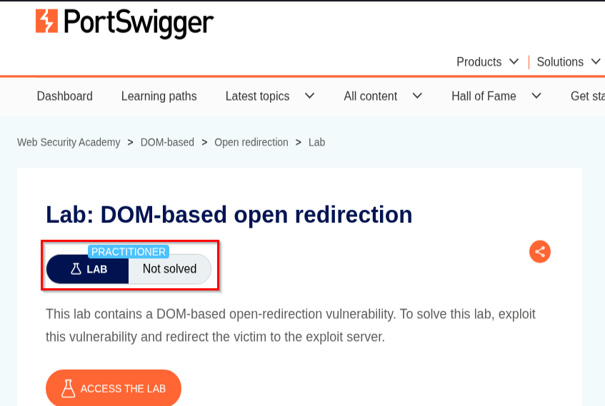
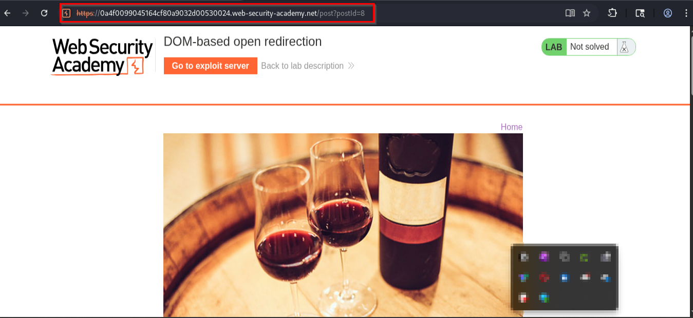
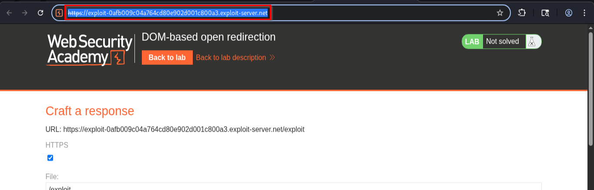
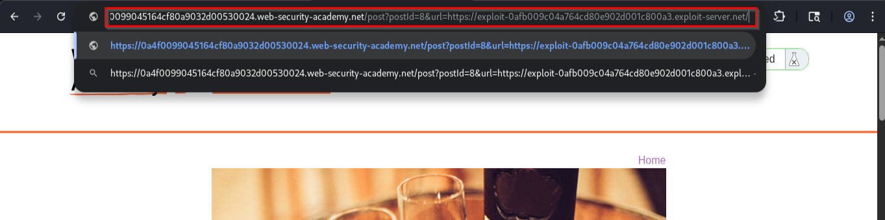

# 📌 Overview

This walkthrough demonstrates the identification and exploitation of a DOM-Based Open Redirect vulnerability within a client-side web application.

The application uses JavaScript to process user-controlled URL parameters and perform browser redirects without validating the destination. Because the redirect occurs entirely within the browser's Document Object Model (DOM), an attacker can manipulate the redirect target and force users to visit attacker-controlled websites.

By supplying the exploit server URL through the vulnerable parameter, it was possible to trigger an unauthorized redirect and successfully solve the lab.

---

# 🛠 Tools Used

| Tool                             | Purpose                             |
| -------------------------------- | ----------------------------------- |
| Kali Linux                       | Operating environment               |
| Firefox Browser                  | Browser interaction                 |
| PortSwigger Web Security Academy | Vulnerable target application       |
| Exploit Server                   | Attacker-controlled redirect target |

---

# 🧭 Walkthrough

## Step 1 - Access the Lab

Opened the PortSwigger Web Security Academy lab:

**DOM-Based Open Redirection**

The lab description explained that the application contained a DOM-Based Open Redirect vulnerability.

The objective was to exploit the vulnerability and redirect the victim to the provided exploit server.

✔ Lab initialized successfully

📸 Evidence 1 - Lab overview and objective



---

## Step 2 - Open the Vulnerable Page

After launching the lab, the application displayed a blog post page.

The URL contained the following parameter:

```http
GET /post?postId=8
```

The page itself appeared normal, but the objective was to identify functionality that could be abused to perform a redirect.

✔ Target page identified

📸 Evidence 2 - Vulnerable blog post page



---

## Step 3 - Access the Exploit Server

The exploit server provided by the lab environment was opened.

The server generated a unique attacker-controlled URL which would be used as the redirect destination.

Example:

```text
https://exploit-xxxxxxxxxxxxxxxx.exploit-server.net/
```

✔ Exploit server obtained

📸 Evidence 3 - Exploit server URL



---

## Step 4 - Craft the Malicious URL

Testing revealed that the application accepted a parameter named:

```text
url
```

The exploit server URL was supplied through this parameter.

Modified URL:

```http
GET /post?postId=8&url=https://exploit-xxxxxxxxxxxxxxxx.exploit-server.net/
```

Full example:

```text
https://LAB-ID.web-security-academy.net/post?postId=8&url=https://exploit-xxxxxxxxxxxxxxxx.exploit-server.net/
```

The crafted URL was then loaded in the browser.

✔ Malicious redirect URL created

📸 Evidence 4 - Crafted exploit URL



---

## Step 5 - Verify Lab Completion

When the crafted URL was visited, the application's client-side JavaScript processed the supplied parameter and immediately redirected the browser to the attacker-controlled exploit server.

This behavior confirmed that the application trusted user-controlled input and performed redirects without validating the destination.

The Web Security Academy interface displayed:

```text
LAB Solved
```

confirming that the DOM-Based Open Redirect vulnerability had been successfully exploited.

✔ Redirect executed successfully

✔ Victim redirected successfully

✔ Lab marked as solved

📸 Evidence 5 - Lab solved confirmation


---

# 📌 Conclusion

This walkthrough demonstrated the successful exploitation of a DOM-Based Open Redirect vulnerability. By manipulating a user-controlled URL parameter, it was possible to influence client-side redirect logic and force users to visit an attacker-controlled website.

Although Open Redirect vulnerabilities are often considered lower severity issues, they can significantly increase the effectiveness of phishing attacks, credential harvesting campaigns, and other social engineering techniques when combined with trusted domains.

Applications should validate redirect destinations, restrict redirects to trusted domains, and avoid using user-controlled input directly within redirect functionality.

---


